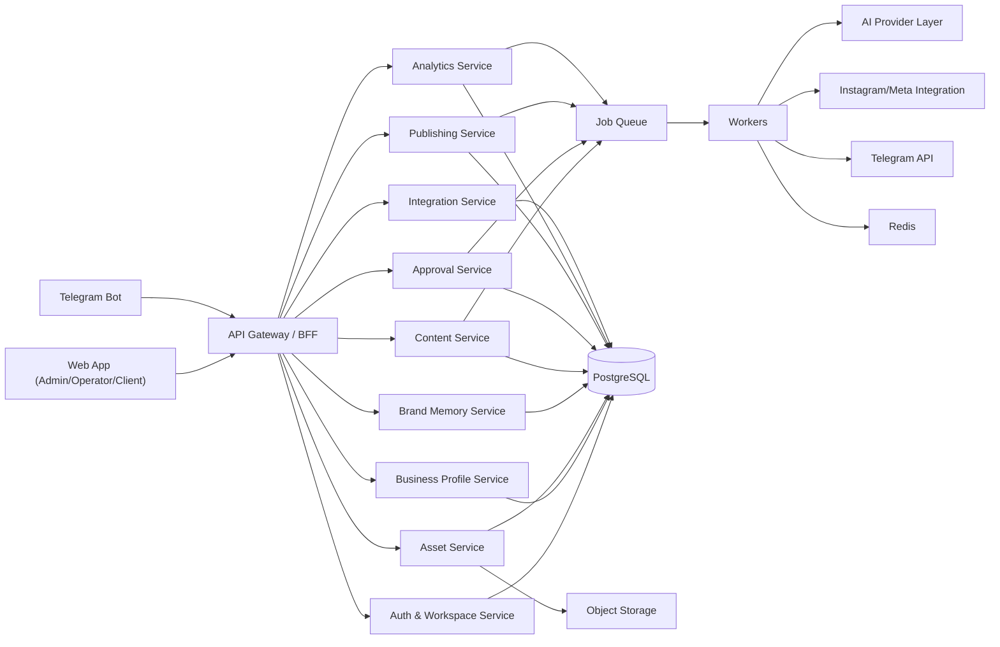

# Technical Architecture

## Architecture Goal

Build an Instagram-first, multi-tenant platform where:

- the internal team onboards and manages brands
- AI generates content from business context and media assets
- clients approve or revise via web or Telegram
- publishing runs on schedule
- performance data feeds future recommendations

## High-Level System



## Recommended Monorepo Structure

```text
apps/
  web/
  api/
workers/
  content-worker/
  approval-worker/
  publish-worker/
  analytics-worker/
packages/
  ui/
  config/
  types/
  database/
  ai/
  integrations/
docs/
```

## Core Service List

## 1. Auth & Workspace Service

### Responsibility

- authentication
- authorization
- workspace membership
- role management
- session handling

### Core Entities

- user
- workspace
- workspace_member
- role

## 2. Business Profile Service

### Responsibility

- business identity
- operational metadata
- marketing goals
- target actions
- tone and CTA preferences

### Core Entities

- business
- branch
- business_settings

## 3. Asset Service

### Responsibility

- media upload
- object storage references
- asset tagging
- quality scoring
- usage tracking

### Core Entities

- asset
- asset_tag
- asset_usage
- product

## 4. Brand Memory Service

### Responsibility

- structured AI-understood brand context
- personas
- content pillars
- language constraints
- visual guidance

### Core Entities

- brand_profile
- persona
- content_pillar
- brand_rule

## 5. Content Service

### Responsibility

- strategy generation
- content generation
- variations
- draft lifecycle
- editorial metadata

### Core Entities

- content_strategy
- content_item
- content_variant
- content_asset_link

## 6. Approval Service

### Responsibility

- approval routing
- internal/client review states
- Telegram review actions
- revision history

### Core Entities

- approval_request
- approval_action
- revision_request

## 7. Publishing Service

### Responsibility

- scheduling
- queueing
- publishing to integrations
- failure handling
- retry tracking

### Core Entities

- publish_job
- publish_attempt
- external_post

## 8. Analytics Service

### Responsibility

- ingest platform metrics
- normalize analytics
- compute insight summaries
- track content performance

### Core Entities

- metric_snapshot
- content_performance
- insight

## 9. Campaign Service

### Responsibility

- manage launches and promotions
- attach products/assets
- influence content generation

### Core Entities

- campaign
- campaign_product
- campaign_asset

## 10. Integration Service

### Responsibility

- Instagram/Meta credentials
- Telegram link state
- webhook or polling state
- provider configuration

### Core Entities

- integration_account
- telegram_chat_link
- provider_credential

## 11. AI Orchestration Service

### Responsibility

- provider abstraction
- prompt composition
- brand-memory context retrieval
- content generation pipelines
- structured outputs

### Interfaces

- `generateBrandMemory()`
- `generateWeeklyStrategy()`
- `generateContentItem()`
- `regenerateCaption()`
- `generateTelegramReplyOptions()`
- `generateInsightSummary()`

## Data Model

## Tenant and Identity

### `users`

- id
- email
- name
- phone
- created_at
- updated_at

### `workspaces`

- id
- name
- slug
- timezone
- created_at
- updated_at

### `workspace_members`

- id
- workspace_id
- user_id
- role
- status
- created_at

## Business Domain

### `businesses`

- id
- workspace_id
- name
- category
- description
- price_segment
- address
- city
- country
- phone
- website_url
- primary_goal
- reservation_url
- whatsapp_url
- publish_mode
- status
- created_at
- updated_at

### `branches`

- id
- business_id
- name
- address
- city
- timezone
- opening_hours_json
- is_primary
- created_at
- updated_at

### `products`

- id
- business_id
- name
- description
- price_text
- category
- priority_score
- is_active
- launch_date
- created_at
- updated_at

### `business_settings`

- id
- business_id
- preferred_language
- tone_summary
- cta_preferences_json
- forbidden_phrases_json
- target_audience_json
- peak_hours_json
- seasonal_notes_json
- approval_policy_json
- created_at
- updated_at

## Brand Memory

### `brand_profiles`

- id
- business_id
- version
- summary
- voice_guidelines
- visual_guidelines
- customer_personas_json
- strategy_notes
- generated_by
- locked_at
- created_at
- updated_at

### `content_pillars`

- id
- business_id
- name
- description
- priority
- active
- created_at
- updated_at

### `brand_rules`

- id
- business_id
- type
- label
- value
- created_at

## Assets

### `assets`

- id
- business_id
- storage_key
- mime_type
- file_name
- media_type
- width
- height
- duration_seconds
- source
- quality_score
- is_featured
- uploaded_by
- created_at

### `asset_tags`

- id
- asset_id
- tag
- confidence
- created_at

### `asset_links`

- id
- asset_id
- linked_type
- linked_id
- created_at

### `asset_usages`

- id
- asset_id
- content_item_id
- usage_type
- created_at

## Campaigns

### `campaigns`

- id
- business_id
- name
- description
- objective
- start_date
- end_date
- status
- priority
- created_by
- created_at
- updated_at

### `campaign_products`

- id
- campaign_id
- product_id

### `campaign_assets`

- id
- campaign_id
- asset_id

## Content Strategy and Content

### `content_strategies`

- id
- business_id
- period_start
- period_end
- strategy_type
- summary
- post_count
- reel_count
- story_count
- generation_status
- created_by
- created_at

### `content_items`

- id
- business_id
- strategy_id
- campaign_id
- branch_id
- type
- status
- title
- pillar_name
- target_action
- planned_for
- scheduled_for
- published_at
- approval_required
- needs_client_approval
- generated_by
- created_at
- updated_at

### `content_variants`

- id
- content_item_id
- variant_label
- caption
- hook
- cta
- hashtags_json
- reel_script
- shot_list_json
- cover_text
- is_active
- created_at

### `content_item_assets`

- id
- content_item_id
- asset_id
- role
- sort_order

## Approval and Revision

### `approval_requests`

- id
- content_item_id
- channel
- requested_from_user_id
- telegram_chat_id
- status
- requested_at
- expires_at
- resolved_at

### `approval_actions`

- id
- approval_request_id
- actor_user_id
- channel
- action
- note
- metadata_json
- created_at

### `revision_requests`

- id
- content_item_id
- requested_by_user_id
- source
- reason_code
- note
- status
- created_at
- resolved_at

## Publishing

### `integration_accounts`

- id
- business_id
- provider
- account_name
- external_account_id
- status
- metadata_json
- created_at
- updated_at

### `telegram_chat_links`

- id
- business_id
- chat_id
- chat_title
- linked_by_user_id
- status
- created_at

### `publish_jobs`

- id
- content_item_id
- integration_account_id
- scheduled_for
- status
- retry_count
- last_error
- created_at
- updated_at

### `publish_attempts`

- id
- publish_job_id
- attempted_at
- status
- response_code
- response_summary

### `external_posts`

- id
- content_item_id
- provider
- external_post_id
- external_permalink
- published_at

## Analytics

### `metric_snapshots`

- id
- content_item_id
- provider
- snapshot_at
- reach
- impressions
- likes
- comments
- shares
- saves
- profile_visits
- link_clicks
- dm_clicks
- whatsapp_clicks
- video_views
- avg_watch_seconds

### `content_performance`

- id
- content_item_id
- performance_score
- engagement_rate
- conversion_signal_score
- best_time_score
- cta_score
- updated_at

### `insights`

- id
- business_id
- period_start
- period_end
- insight_type
- title
- body
- data_json
- created_at

## Telegram Interaction Model

## Incoming Update Types

- slash command
- button callback
- media upload
- free text note

## Telegram-to-System Mapping

- `/newproduct` -> create product draft
- `/campaign` -> create campaign draft
- `Approve` -> approval action
- `Revise` -> revision request
- `Pause` -> set publish mode pause flag
- `Resume` -> restore publish mode

## Event-Driven Workflow

## Core Domain Events

- `business.created`
- `assets.uploaded`
- `brand_profile.generated`
- `strategy.generated`
- `content.generated`
- `content.reviewed`
- `content.sent_for_approval`
- `content.approved`
- `content.revision_requested`
- `publish_job.created`
- `content.published`
- `publish_job.failed`
- `metrics.ingested`
- `insight.generated`
- `product.submitted`
- `campaign.created`

## Job Queues

- `brand-memory`
- `content-generation`
- `telegram-notifications`
- `approval-timeouts`
- `publishing`
- `analytics-sync`
- `insight-generation`

## API Surface

## Internal/Frontend Endpoints

- `POST /auth/login`
- `GET /workspaces`
- `POST /businesses`
- `GET /businesses/:id`
- `PATCH /businesses/:id`
- `POST /assets/upload`
- `POST /assets/:id/tags`
- `POST /brand-profiles/generate`
- `POST /content-strategies/generate`
- `GET /content/calendar`
- `GET /content/:id`
- `PATCH /content/:id`
- `POST /content/:id/send-approval`
- `POST /campaigns`
- `GET /analytics/summary`

## Telegram Webhook Endpoints

- `POST /webhooks/telegram`

## Integration Endpoints

- `POST /webhooks/meta`
- `POST /jobs/publish/:id/run`
- `POST /jobs/analytics-sync/:businessId/run`

## Suggested Build Sequence

## Milestone 1: Foundation

- monorepo setup
- auth
- workspace model
- database setup
- shared UI/design system

## Milestone 2: Business Context

- business profile CRUD
- asset library
- product catalog
- brand memory generation

## Milestone 3: Content Ops

- strategy generation
- content item CRUD
- content variants
- calendar UI

## Milestone 4: Telegram Workflow

- Telegram bot webhook
- approval actions
- revision flow
- pause/resume commands

## Milestone 5: Publishing

- scheduler
- publish queue
- publish status tracking

## Milestone 6: Analytics

- metric ingestion
- performance scoring
- insights generation

## Suggested Initial Engineering Choices

- Prefer a modular monolith first, not microservices.
- Use queue-backed workers for AI generation, approvals, publishing, and analytics.
- Keep provider-specific logic in integration adapters.
- Store structured AI outputs, not just plain text blobs.
- Version brand memory so changes are auditable.
- Keep Telegram as a thin interaction layer, not a source of truth.

## Initial Non-Goals

- multi-platform publishing from day one
- advanced video generation
- public-facing marketing site CMS
- custom design editor
- granular franchise hierarchy
- full self-serve onboarding
